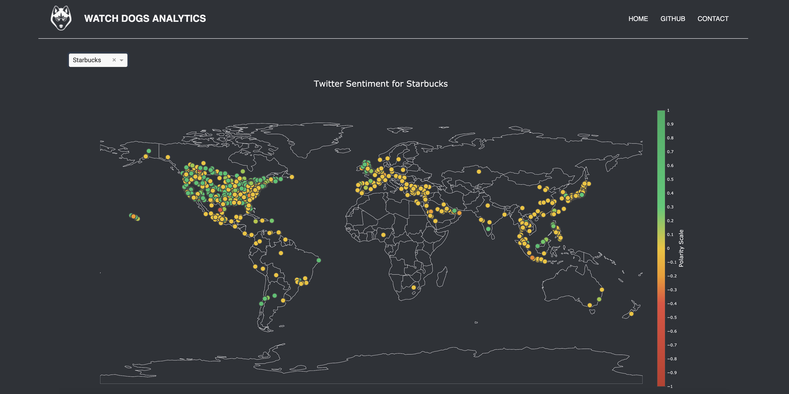
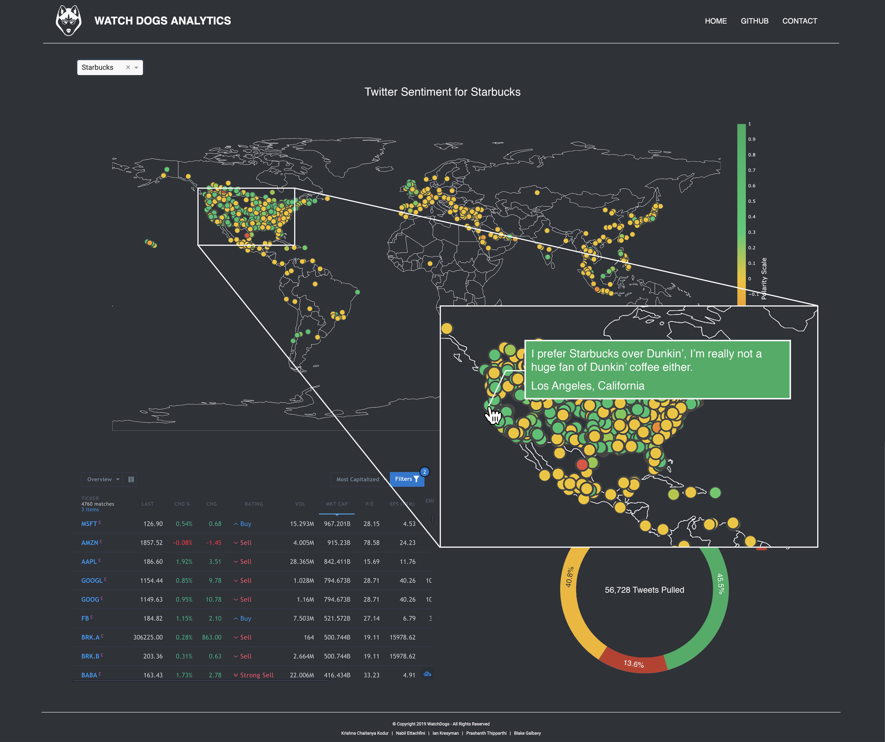
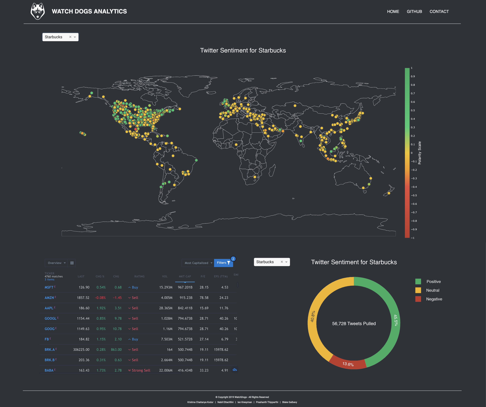

# WatchDogs_StockMarketAnalysis
## Repositories Owners:

WatchDogs_Mongo_wrapper & Database Populator & ELK_Docker : Krishna Chaitanya Kodur  
Kafka_Spark_Mongodb : Prashanth Thipparthi  
WatchDogs_APIServer : Krishna Chaitanya Kodur, Blake Galbavy  
Docker, Kubernetes, Travis CI, Complete CI/CD: Krishna Chaitanya Kodur  
Redis Cache: Krishna Chaitanya Kodur  
WatchDogs_Visualisation : Ian Kresyman   |   Nabil Ettachfini  

## Introduction:  
WatchDogs is a web-based analytical tool developed to help visualize the relationship between stock activity and market sentiment using Twitter data.  

## Architecture:

## Description of the Project

## Website View

